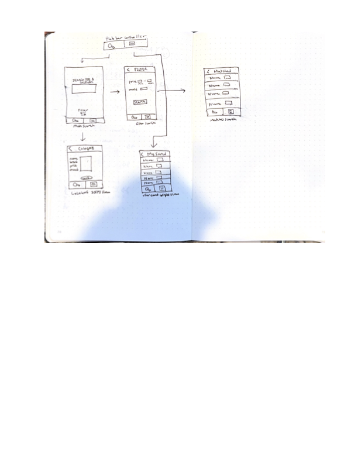

# Cologne Finder

## Table of Contents

1. [Overview](#Overview)
2. [Product Spec](#Product-Spec)
3. [Wireframes](#Wireframes)
4. [Schema](#Schema)

## Overview

### Description

Consumers in the market for a new cologne can find a scent they like within their budget and mood that they are looking for.

### App Evaluation

[Evaluation of your app across the following attributes]
- **Category:** Lifestyle 
- **Mobile:** User can easily open the application and view colognes in a list view, making it very readable and user friendly.
- **Story:** Consumers can get easily overwhelmed when it comes to finding a cologne with how many options there are. This is where Cologne Finder comes in. The app will make the lives of consumers so much easier by refining their options based on their preferences like price, mood, etc.
- **Market:** Anyone in the market for a new cologne.
- **Habit:** Not necessarily an app a user will check daily, but the app still provides immense value with the amount of time saved.
- **Scope:** Can start with basic functionality. User will look for a catgory and then there will be a new view with a list of colognes that match the criteria. With basic functionality implemented, we can focus on improving the UI.

## Product Spec

### 1. User Stories (Required and Optional)

**Required Must-have Stories**

* As a user, I can search for a cologne
* As a user, I can get the cologne name, price, mood, brand 
* As a user, I can enter in a budget and find colognes that match my budget
* As a user, I can select a mood from a list of moods and find colognes that match my budget

**Optional Nice-to-have Stories**

* As a user, I can click on a cologne and it will direct me to a link to purchase it
* As a user, I can save cologne's I like and see them in a saved cologne's page
* As a user, I can add notes about a cologne eg. if I own it, the smell, my opinion

### 2. Screen Archetypes

- Search Screen (main search)
    * User can search for a cologne
- Search Screen (filter search)
    * User can set filters and search for matches
- Stream screen (matches screen)
    * User can see the colognes that match their preferences
- Stream Screen (user-saved colognes screen)
    * User can see their saved colognes
- Detail screen (cologne information screen)
    * User can see the name, brand, price and mood of a particular cologne

### 3. Navigation

**Tab Navigation** (Tab to Screen)

* Search Cologne
* Saved Colognes (in a future version)

**Flow Navigation** (Screen to Screen)

* Search Screen (main search)
    - => Detail Screen (if they simply look up the name of a cologne)
    - => Search Screen (if they filter based on their preferences)
* Search Screen (filter search)
    - => Stream Screen (see matches for user-selected preferences)
* Stream Screen (matches screen)
    * => None, but a future version will navigate to a detailed screen to see more information about a cologne
* Detail Screen (cologne information screen)
    * => None
* Stream Screen (user-saved colognes screen)
     * => None, but a future version will navigate to a detailed screen to see more information about a cologne

## Wireframes

[Mock 1]

## Schema 

[This section will be completed in Unit 9]

### Models

[Add table of models]

### Networking

- [Add list of network requests by screen ]
- [Create basic snippets for each Parse network request]
- [OPTIONAL: List endpoints if using existing API such as Yelp]

## Required Features

The following **required** functionality is completed:

- [X] As a user, I can search for a cologne
- [X] As a user, I can get the cologne name, price, mood, brand 
- [X] As a user, I can enter in a budget and find colognes that match my budget
- [X] As a user, I can select a mood from a list of moods and find colognes that match my budget.

The following additional features are implemented:

- [X] As a user, I can save a cologne
- [X] As a user, I can view the colognes I've saved in my saved tab

What I worked On:
 - Basic UI implementation
 - Added logic and enhanced UI

 ## Video Walkthrough

 

    <a href="https://www.loom.com/share/4228f6a542bd4bdda4fbfa4f8f1769c0">
      
Milestone # 1 - HackMD - 15 April 2024 - Watch Video

    </a>
    
  

  

    <a href="https://www.loom.com/share/bee622aa9f6041b2871e810b53d9fa65">
      
Milestone # 2 - 23 April 2024 - Watch Video

    </a>
    
  
